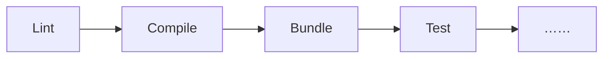

# [0014. Tasks](https://github.com/Tdahuyou/TNotes.vscode/tree/main/notes/0014.%20Tasks)

<!-- region:toc -->

- [1. 📝 概述](#1--概述)
- [2. 🤔 Tasks 是什么？](#2--tasks-是什么)
- [3. 🤔 运行任务和直接运行命令有什么区别？](#3--运行任务和直接运行命令有什么区别)
- [4. 🤔 任务的常见配置字段都有哪些？](#4--任务的常见配置字段都有哪些)
- [5. 📒 Tasks 自动检测](#5--tasks-自动检测)
- [6. 🤔 problemMatcher 是什么？](#6--problemmatcher-是什么)
- [7. 🤔 problemMatcher 有什么用？](#7--problemmatcher-有什么用)
- [8. 🤔 problemMatcher 都有那些类型？](#8--problemmatcher-都有那些类型)
- [9. 🤔 预定义的问题匹配器都有哪些？](#9--预定义的问题匹配器都有哪些)
- [10. 🤔 什么时候用内置的？什么时候需要自定义？](#10--什么时候用内置的什么时候需要自定义)
- [11. 🤔 如何选择内置的 `problemMatcher`？判断流程是？](#11--如何选择内置的-problemmatcher判断流程是)
- [12. 💻 demos.2 - 实现一个简单的 echo hello world 任务](#12--demos2---实现一个简单的-echo-hello-world-任务)
- [13. 💻 demos.3 - 开发流程自动化 - `…… -> Lint -> Compile -> Bundle -> ……`](#13--demos3---开发流程自动化------lint---compile---bundle---)
- [14. 💻 demos.1 - 实现一个简单的 gcc 编译任务](#14--demos1---实现一个简单的-gcc-编译任务)
- [15. 🔗 References](#15--references)

<!-- endregion:toc -->

## 1. 📝 概述

- 理解任务是什么
- 理解任务的作用
- 掌握任务的基本使用
- 理解运行任务和直接运行命令的区别
- 理解任务中的 problemMatcher 配置
- 知道如何自定义 problemMatcher

## 2. 🤔 Tasks 是什么？

- 这里提到的 Tasks 是 VS Code 中的任务功能，定义在 `.vscode/tasks.json` 配置文件中。
- Tasks 可以把重复的工作自动化。
- Tasks 的核心价值：**流程封装 + 自动调度**。

## 3. 🤔 运行任务和直接运行命令有什么区别？

- **🤔 我们是不是也可以不使用 tasks，直接在终端运行命令，区别无非就是是否会在问题面板中输出更友好的 bug 位置导航链接？**
  - **是的，你可以直接在终端运行命令，而且很多时候开发者确实这么做。但使用 `tasks.json` + `problemMatcher` 带来的不仅仅是“更友好的链接”，而是一整套集成开发体验的提升。**
  - 其实很多编译或者测试工具，在输出信息中就带有了错误发生的文件、行、列等信息，如果只是为了在问题面板中的 bug 快速导航这一个功能点的话，其实完全没必要刻意将命令封装到 VS Code 的任务中。之所以要将命令封转到任务中，而不是直接简单的手敲，更多是为了“使用 VS Code 提供的任务功能”，比如：
    - 你可以使用命令面板快速运行配置好的任务。
    - 你可以自定义任务运行的依赖关系，**自动化、结构化、集成化** 做得更加完善。
    - 内置了 `watch` 模式的支持，文件保存后自动重新运行任务，这样你写代码时就可以轻松做到 **保存即编译 + 实时错误提示** 的效果。
    - problemMatcher 匹配的信息，除了能用于 bug 导航，还可以一键喂给 AI 工具，让 AI 编程助手获取到错误信息，一键帮你修复问题。
    - 跨平台一致性的支持，适配不同操作系统，确保团队成员在 Windows/macOS/Linux 上都能运行。
    - Tasks 可以更方便地被其他工具调用，也更有助于团队之间的协作沟通。
    - ……
- 对比总结

| 功能          | 终端手动运行    | 使用 `tasks.json` + `problemMatcher` |
| ------------- | --------------- | ------------------------------------ |
| 运行命令      | ✅ 简单         | ✅ 需要配置，但可复用                |
| 查看输出      | ✅ 实时完整     | ✅ 支持问题提取                      |
| 错误跳转      | ❌ 可能需手动找 | ✅ 点击跳转到文件行                  |
| 错误管理      | ❌ 文本滚动     | ✅ Problems 面板分类管理             |
| 自动化构建    | ❌ 手动触发     | ✅ 支持 `watch` 模式                 |
| 与 Debug 集成 | ❌ 不行         | ✅ 可设 `preLaunchTask`              |
| 团队共享      | ❌ 靠口头说明   | ✅ 提交到 Git，人人可用              |
| 多步骤任务    | ❌ 手动一步步敲 | ✅ 可定义依赖链                      |

- **🤔 什么时候该用哪个？**

| 场景 | 推荐方式 |
| --- | --- |
| 初次尝试某个命令，调试输出格式 | ✅ 直接终端运行 |
| 探索性开发，临时检查问题 | ✅ 终端更快 |
| 正式项目，需要稳定构建流程 | ✅ 用 `tasks.json` |
| 团队协作，希望统一构建方式 | ✅ 必须用 `tasks.json` |
| 希望保存后自动检查错误 | ✅ 用 `tasks.json` + `watch` + `problemMatcher` |
| 想在 Debug 前自动编译 | ✅ 用 `tasks.json` 并设为 `preLaunchTask` |

- 一些实践建议
  1. **开发初期**：在终端试命令，确认输出格式。
  2. **稳定后**：把常用命令写入 `tasks.json`，配置 `problemMatcher`。
  3. **团队项目**：提交 `.vscode/tasks.json`，让所有人受益。
  4. **结合快捷键**：比如 `Ctrl+Shift+B` 默认运行 build task，提升效率。

## 4. 🤔 任务的常见配置字段都有哪些？

| 字段名 | 说明 |
| --- | --- |
| label | 任务在用户界面中使用的标签。 |
| detail | 任务的详情描述，在用户界面中显示为任务标签的鼠标悬停提示。 |
| type | 任务的类型。对于自定义任务，这可以是 shell 或 process 。如果指定了 shell ，则命令被解释为一个 shell 命令（例如：bash、cmd 或 PowerShell）。如果指定了 process ，则命令被解释为要执行的进程。 |
| command | 实际执行的命令。 |
| args | 命令的参数。 |
| group | 定义任务所属的组。常见的组有 build、test 等，VS Code 提供了快速执行属于 test、build 组的命令。 |
| presentation | 定义任务输出在用户界面中的处理方式。比如，显示输出的集成终端是否是一直显示的，每次运行任务时是否都需要创建一个新的终端。 |
| options | 覆盖 cwd （当前工作目录）、 env （环境变量）或 shell （默认 shell）的默认值。选项可以针对每个任务设置，也可以全局或按平台设置。这里配置的环境变量只能在您的任务脚本或进程中引用，如果它们是您的参数、命令或其他任务属性的一部分，则不会被解析。 |
| runOptions | 定义任务的运行时间和方式。 |
| hide | 将任务从"运行任务快速选择"中隐藏，这对于复合任务中不独立运行的部分非常有用。 |

- 

## 5. 📒 Tasks 自动检测

- Visual Studio Code 为 Gulp、Grunt、Jake 和 npm 提供了 Task 自动检测的支持，无须开发者手动配置 tasks.json 文件。
- 如果你正在开发一个 Node.js 的项目，则项目中通常会有一个 package.json 文件，Visual Studio Code 会通过 package.json 自动检测出相应的 npm Task。当然，你也可以将这些 npm scripts 添加到 tasks.json 中，不过这并不会覆盖自动检测的 npm tasks，两者会共存于 tasks 列表中。
- 以 TNotes.xxx 知识库项目为例，就将 npm 脚本配置为了 tasks.json 文件中的 VS Code 能识别的任务，以便快速通过命令 run tasks 来执行指定脚本。

::: code-group

```json [.vscode/tasks.json]
{
  "version": "2.0.0",
  "tasks": [
    {
      "label": "tn:new",
      "detail": "新建一篇笔记",
      "type": "shell",
      "command": "npm run tn:new",
      "group": {
        "kind": "build"
      },
      "problemMatcher": ["$tsc"]
    },
    {
      "label": "tn:dev",
      "detail": "启动知识库开发环境",
      "type": "shell",
      "command": "npm run tn:dev",
      "group": "build",
      "problemMatcher": ["$tsc"]
    },
    {
      "label": "tn:update",
      "detail": "根据笔记内容更新知识库",
      "type": "shell",
      "command": "npm run tn:update",
      "group": "build",
      "problemMatcher": ["$tsc"]
    },
    {
      "label": "tn:push",
      "detail": "将知识库推送到 github",
      "type": "shell",
      "command": "npm run tn:push",
      "group": "build",
      "problemMatcher": ["$tsc"]
    },
    {
      "label": "tn:pull",
      "detail": "将 github 的知识库拉下来",
      "type": "shell",
      "command": "npm run tn:pull",
      "group": "build",
      "problemMatcher": ["$tsc"]
    },
    {
      "label": "tn:merge",
      "detail": "合并知识库中的所有笔记到一个文件 MERGED_README.md 中（所有笔记数据汇总到一个文件中进行批量编辑，常用于快速统一所有笔记格式等需要批量操作多篇笔记的场景）",
      "type": "shell",
      "command": "npm run tn:merge",
      "group": "build",
      "problemMatcher": ["$tsc"]
    },
    {
      "label": "tn:distribute",
      "detail": "分发 MERGED_README.md 文件中的内容到各笔记中（配合 tn:merge 使用）",
      "type": "shell",
      "command": "npm run tn:distribute",
      "group": "build",
      "problemMatcher": ["$tsc"]
    },
    {
      "label": "tn:tempSync",
      "detail": "同步知识库脚本到其它 TNotes.xxx 知识库中",
      "type": "shell",
      "command": "npm run tn:tempSync",
      "group": "build",
      "problemMatcher": ["$tsc"]
    },
    {
      "label": "tn:pushAll",
      "detail": "推送所有 TNotes.xxx 知识库到 GitHub",
      "type": "shell",
      "command": "npm run tn:pushAll",
      "group": "build",
      "problemMatcher": ["$tsc"]
    },
    {
      "label": "tn:build",
      "detail": "构建知识库",
      "type": "shell",
      "command": "npm run tn:build",
      "group": "build",
      "problemMatcher": ["$tsc"]
    },
    {
      "label": "tn:preview",
      "detail": "预览构建后的知识库",
      "type": "shell",
      "command": "npm run tn:preview",
      "group": "build",
      "problemMatcher": ["$tsc"]
    },
    {
      "label": "tn:pullAll",
      "detail": "拉取所有 TNotes.xxx 知识库，确保本地的仓库是最新的",
      "type": "shell",
      "command": "npm run tn:pullAll",
      "group": "build",
      "problemMatcher": ["$tsc"]
    },
    {
      "label": "tn:sync",
      "detail": "同步本地和远程的知识库状态",
      "type": "shell",
      "command": "npm run tn:sync",
      "group": "build",
      "problemMatcher": ["$tsc"]
    },
    {
      "label": "tn:syncAll",
      "detail": "同步所有知识库",
      "type": "shell",
      "command": "npm run tn:syncAll",
      "group": "build",
      "problemMatcher": ["$tsc"]
    }
  ]
}
```

:::

## 6. 🤔 problemMatcher 是什么？

- 先从字面上来理解：
  - problem 表示“问题”
  - matcher 表示“匹配器”
  - 两者一起 `problemMatcher` 就表示“问题匹配器”
- 🤔 `problemMatcher` 是什么
  - `problemMatcher` 是 VS Code 任务配置文件 `tasks.json` 中的一个配置字段。
- 🤔 在 `tasks.json` 中，`problemMatcher` 配置有啥用？
  - 在 Visual Studio Code（VSCode）中，`tasks.json` 文件用于定义项目中的自定义任务（如编译、构建、测试等）。其中的 `problemMatcher` 是一个非常重要的配置项，它的作用是 **从任务的输出中提取错误、警告等信息，并在 VSCode 的“问题”面板中显示出来**，从而帮助开发者快速定位代码中的问题。
  - `problemMatcher` 是 VS Code 中用于在任务执行时 **识别控制台输出中的错误和警告信息** 的配置项。
  - `problemMatcher` 会根据预定义或自定义的规则，将任务输出中的文本 **匹配为“问题”（错误或警告）**，并展示在“问题”面板中，同时在编辑器中高亮显示相关代码位置（如果匹配到文件和行号）。
- 🤔 如何匹配？
  - 1️⃣ 可以自定义，手写正则来匹配。
  - 2️⃣ 可以使用内置的问题匹配器来匹配，相当于用 VSCode 已经写好的匹配规则来匹配。
  - 原理简述：任务的执行就如同 Shell 命令的执行，会有对应的输出，比如 stdout 或 stderr，这些字符串信息 VS Code 会去收集，并使用 `problemMatcher` 来解析。在手写 `problemMatcher` 的时候，可以自定义 `problemMatcher.pattern.regexp` 正则表达式，比如 `^([^\\s].*)\\((\\d+),(\\d+)\\):\\s+(error|warning|info)\\s+(.*)$`，这个表达式有多个捕获组，这些捕获组可作为下面这些问题信息的占位符使用：
    - `problemMatcher.pattern.file`
    - `problemMatcher.pattern.line`
    - `problemMatcher.pattern.line`
    - `problemMatcher.pattern.column`
    - `problemMatcher.pattern.severity`
    - `problemMatcher.pattern.message`
  - VS Code 会将这些捕获组中的内容替换成对应的占位符来组合错误消息。
- 总结
  - `problemMatcher` 让 VSCode 能“理解”构建工具的输出。
  - 优先使用内置 matcher（如 `$tsc`, `$gcc`）。
  - 自定义 matcher 需要正确配置正则和路径解析。
  - 正确配置后，可实现“点击错误跳转到代码行”的开发体验。

## 7. 🤔 problemMatcher 有什么用？

- 当你运行一个构建任务（比如使用 `gcc` 编译 C 程序、`tsc` 编译 TypeScript、`eslint` 检查代码等），编译器或工具通常会在终端输出错误或警告信息。`problemMatcher` 的作用就是：
- **1️⃣ 自动识别错误和警告，并将这些信息汇总显示到“问题”面板中。**
  - 监听任务的输出（stdout 或 stderr）
  - 使用正则表达式匹配输出中的错误/警告信息
  - 将这些信息转换为 VSCode 可识别的“问题”（Problems）显示在 **Problems 面板** 中
- **2️⃣ 支持跳转到出错文件和行号，提升调试效率。**
  - 点击可以直接跳转到对应文件的对应行
- 你可以在 `.vscode/tasks.json` 中结合 `watch` 模式和 `problemMatcher` 实现自动构建 + 实时错误提示，以此来提升开发效率。
- 🤔

## 8. 🤔 problemMatcher 都有那些类型？

- 【1】空数组：表示不匹配任何问题，即便任务运行出现了错误，也不会提示任何消息。
- 【2】预设的问题匹配器：比如 `$tsc`，表示任务被执行时，VS Code 会尝试从输出中提取 TypeScript 错误信息。
- 【3】自定义的问题匹配器：查阅官方文档自行配置匹配规则，通过正则来匹配。

## 9. 🤔 预定义的问题匹配器都有哪些？

- VSCode 内置 Problem Matcher 参考表

| Matcher | 说明 | 适用场景/工具 |
| --- | --- | --- |
| **`$tsc`** | 匹配 TypeScript 编译器 (`tsc`) 的标准输出 | `tsc` 编译任务 |
| **`$tsc-watch`** | 匹配 `tsc --watch` 模式的增量编译输出（支持实时更新问题） | TypeScript 监视模式任务 |
| **`$jshint`** | 匹配 JSHint 的默认输出格式 | JSHint 代码检查 |
| **`$jshint-stylish`** | 匹配 JSHint 的 `stylish` 格式化输出（更易读的多行格式） | 使用 `--reporter=stylish` 时 |
| **`$eslint-stylish`** | 匹配 ESLint 的 `stylish` 格式化输出（默认可视化格式） | ESLint 默认输出 |
| **`$eslint-compact`** | 匹配 ESLint 的 `compact` 单行格式（简洁的问题摘要） | 使用 `--format=compact` 时 |
| **`$go`** | 匹配 Go 工具链的错误和警告（如 `go build` / `go test`） | Go 语言编译/测试 |
| **`$mscompile`** | 匹配 MSBuild / .NET 编译器的错误格式（C#/VB/F#） | Visual Studio 项目构建 |
| **`$lessc`** | 匹配 Less 编译器的错误输出 | Less 样式文件编译 |
| **`$node-sass`** | 匹配 Node-sass 的错误输出（Sass 编译错误） | Sass 样式编译任务 |

- 预设好的这些 matcher 可以直接拿来用，不需要再自行手写。
- 不需要自己手写 matcher 的情况其实蛮多的，社区找一找基本都能找到，以 gcc 为例，你完全可以通过安装 Microsoft 的 C/C++ 插件来自动注入 `$gcc` 的 matcher，然后直接使用它。

## 10. 🤔 什么时候用内置的？什么时候需要自定义？

- 选择使用 **内置的 `problemMatcher`** 还是**自定义的**，取决于你使用的构建工具和输出格式。
- **使用内置 `problemMatcher` 的情况（推荐优先尝试）**
  - 当你使用的工具是常见且格式标准化的编译器或 Linter，**并且其错误输出格式是 VSCode 已知的**，就应优先使用内置的。
  - 判断标准（满足以下任意一条即可）：

| 条件 | 说明 |
| --- | --- |
| ✅ 工具是主流的（如 `tsc`, `gcc`, `eslint`, `msbuild`, `go build`） | VSCode 为这些工具预定义了 matcher |
| ✅ 错误输出格式是标准的、常见的（如 `file.ts(10,5): error ...`） | 内置 matcher 通常覆盖这些模式 |
| ✅ 官方文档或社区推荐使用某个内置 matcher | 比如 TypeScript 官方推荐 `$tsc` |

- 常见工具与对应内置 matcher：

| 工具                         | 推荐 `problemMatcher`                  |
| ---------------------------- | -------------------------------------- |
| TypeScript (`tsc`)           | `$tsc`                                 |
| GCC / G++ / Clang            | `$gcc`                                 |
| ESLint                       | `$eslint-stylish` 或 `$eslint-compact` |
| Webpack（CLI 输出）          | `$tsc`（有时可用，但建议自定义）       |
| Python（`pylint`, `flake8`） | `$python-lint`（部分支持），或自定义   |
| Go (`go build`)              | `$go`                                  |
| MSBuild（C#）                | `$msbuild`                             |

- **需要自定义 `problemMatcher` 的情况**
  - 当以下情况发生时，就必须自定义：

| 情况 | 说明 |
| --- | --- |
| ❌ 没有合适的内置 matcher | 比如你用的是私有编译器、特殊格式的脚本 |
| ❌ 内置 matcher 匹配失败 | 虽然用了 `$tsc`，但 Problems 面板没显示错误 |
| ❌ 输出格式不标准 | 比如日志前加了时间戳、颜色代码、包装信息等 |
| ❌ 多行错误信息 | 如 Python 的 traceback、Java 的 stack trace |
| ❌ 使用自定义脚本或 Makefile 输出特殊格式 | 格式特殊，需自定编写正则来处理 |

- 一言蔽之，内置的 `problemMatcher` 匹配失败，再自行编写正则来匹配。
  - 先尝试用内置的来试试看。
  - 如果对于内置匹配器满足不了需求，再自行编写正则来匹配。

## 11. 🤔 如何选择内置的 `problemMatcher`？判断流程是？

- 你可以按照以下流程图来选择：

```txt
开始
  ↓
你的构建工具是主流工具吗？（tsc, gcc, eslint, go, etc.）
  ├─ 是 → 查看 VSCode 文档是否支持内置 matcher
  │         ↓
  │       有 → 尝试使用（如 $tsc, $gcc）
  │         ↓
  │       测试：运行任务，看 Problems 面板是否有错误显示？
  │         ├─ 是 → 成功，无需自定义
  │         └─ 否 → 可能输出被包装，需自定义
  └─ 否 → 必须自定义 problemMatcher
```

- 实际判断示例

| 场景 | 是否用内置？ | 选择哪个？ |
| --- | --- | --- |
| 用 `tsc --build` 编译 TS | ✅ 是 | `$tsc` |
| 用 `gcc main.c -o main` | ✅ 是 | `$gcc` |
| 用 `eslint src/**/*.js` | ✅ 是 | `$eslint-compact` |
| 用 `python my_checker.py` 输出 `error: file.py:10: bad syntax` | ❌ 否 | 自定义 |
| 用 `make` 调用脚本，输出带 `[ERROR]` 前缀 | ❌ 否 | 自定义 |

## 12. 💻 demos.2 - 实现一个简单的 echo hello world 任务

::: code-group

<<< ./demos/2/.vscode/tasks.json [.vscode/tasks.json]

:::

- 
- 任务执行后，终端输出的内容如下：
- 

## 13. 💻 demos.3 - 开发流程自动化 - `…… -> Lint -> Compile -> Bundle -> ……`

```json
{
  "version": "2.0.0",
  "tasks": [
    // ……
    {
      "label": "Lint",
      "type": "shell",
      "command": "eslint",
      "args": ["src/**/*.js"],
      "problemMatcher": "$eslint-compact"
    },
    {
      "label": "Compile",
      "type": "shell",
      "command": "tsc",
      "args": ["--build"],
      "dependsOn": ["Lint"],
      "problemMatcher": "$tsc"
    },
    {
      "label": "Bundle",
      "type": "shell",
      "command": "node",
      "args": ["build.js"],
      "dependsOn": ["Compile"]
    }
    // ……
  ]
}
```

1. **只运行最后一步**：`Bundle` 会自动先执行 `Compile` → `Lint`
2. **一键构建**：`Ctrl+Shift+P` → `Run Task` → 选 `Bundle`，全自动
3. **失败即停**：如果 `Lint` 出错，`Compile` 不会执行
4. **集成 Debug**：

```json
"configurations": [
  {
    "name": "Launch App",
    "type": "node",
    "request": "launch",
    "program": "dist/index.js",
    "preLaunchTask": "Bundle"  // 保存即构建 + 启动
  }
]
```

- 你就像一个项目经理，定义好了整个构建流水线：



- 然后你告诉团队成员：“别管中间几步，你只要运行 `Test` 任务，它会自动先 `Lint → Compile → Bundle → Test → ……`。”他们不需要记住顺序，也不会漏掉某一步。
- `tasks.json` 帮你做到了：

| 能力            | 说明                                                |
| --------------- | --------------------------------------------------- |
| 🔗 **依赖管理** | 用 `"dependsOn": ["A", "B"]` 声明依赖，自动按序执行 |
| ⏱️ **自动执行** | 运行一个任务，自动触发它的所有前置任务              |
| 🛑 **失败中断** | 如果某一步失败（如 Lint 出错），后续任务不会执行    |
| 🧩 **可组合性** | 每个任务可以独立运行，也可以作为更大流程的一部分    |
| 📦 **封装细节** | 用户只需关心“我要构建”或“我要测试”，不关心内部步骤  |

- 只运行一个任务，自动完成全流程

```json
{
  "version": "2.0.0",
  "tasks": [
    {
      "label": "Lint",
      "command": "eslint",
      "args": ["src/**/*.ts"]
    },
    {
      "label": "Compile",
      "command": "tsc",
      "args": ["--build"],
      "dependsOn": ["Lint"]
    },
    {
      "label": "Package",
      "command": "zip",
      "args": ["-r", "dist.zip", "dist/"],
      "dependsOn": ["Compile"]
    },
    {
      "label": "Deploy",
      "command": "scp",
      "args": ["dist.zip", "user@server:/app/"],
      "dependsOn": ["Package"]
    }
  ]
}
```

```bash
# 你只需要运行：
Deploy
# VSCode 会自动执行：Lint → Compile → Package → Deploy
# 你不需要手动一步步敲命令，也不用担心顺序错或漏步。
```

- 这其实就是 **“声明式编程”** 的思想：
  - 你**声明**了“我要做什么”和“依赖关系”
  - VSCode **自动帮你调度执行顺序**
  - 你从“操作工人”变成了“流程设计者”
  - 这正是现代开发工具的核心理念：**把重复劳动自动化，把经验固化为配置，让开发者专注在真正有价值的地方。**
- 下面可以简单写一个使用 node 命令依次执行 .js 文件的示例，通过这个示例来模拟流程自动化，以及自动化处理过程中出现错误的情况。
- 比如我们现在的流程是：


::: code-group

<<< ./demos/3/.vscode/tasks.json [.vscode/tasks.json]

<<< ./demos/3/src/1.js [src/1.js]

<<< ./demos/3/src/2.js [src/2.js]

<<< ./demos/3/src/3.js [src/3.js]

:::

- 运行 node-3 任务
  - 
- 正常运行，无报错的情况：2.js 不抛出错误
  - 
- 异常运行，有报错的情况：2.js 抛出错误
  - 

## 14. 💻 demos.1 - 实现一个简单的 gcc 编译任务

::: code-group

<<< ./demos/1/.vscode/tasks.json [.vscode/tasks.json]

<<< ./demos/1/src/main.c [src/main.c]

:::

- 测试流程：
  - 在命令面板中输入 `run task` 运行任务
  - 分别选择不同的任务运行
    - 
  - 对比问题面板中生成的最终结果
- 手写 matcher 的流程：
  - 在终端直接执行命令，可以刻意制造一些错误，以获取到错误的输出字符串示例。
  - 根据示例来编写正则匹配。

```bash
$ gcc -Wall -Wextra -o output src/main.c
src/main.c:8:20: error: use of undeclared identifier 'undefined_variable'
    printf("%d\n", undefined_variable);
                   ^
src/main.c:11:11: error: incompatible integer to pointer conversion initializing 'char *' with an expression of type 'int' [-Wint-conversion]
    char* str = 123;
          ^     ~~~
2 errors generated.
```

- 书写正则，可以借助官方推荐的在线工具 regex101 -> https://regex101.com/
- 

::: warning 🤔 为什么不用 `xxx.ts` 示例而使用 `xxx.c`？

- VSCode 内置 TypeScript 语言服务器实时检测错误，TypeScript 错误会自动显示在问题面板。
- `$tsc` 只是将终端输出转换为问题条目，但语言服务器已经做了这个工作。
- matcher 写不写其实最终效果都没啥差别。

:::

## 15. 🔗 References

- https://code.visualstudio.com/docs/debugtest/tasks
  - VSCode tasks
- https://regex101.com/
  - 辅助正则书写的在线工具
